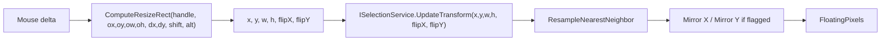

## Bug

Dragging a transform handle past the opposite side of a floating selection should mirror the pixels along that axis (Photoshop / Aseprite "negative resize" → flip). Today both [SelectionInputController.ComputeResizeRect](Hexprite/Controllers/SelectionInputController.cs) and [SelectionService.UpdateTransform](Hexprite/Services/SelectionService.cs) clamp width/height with `Math.Max(1, ...)`, so the box stops at 1 px and the floating pixels never mirror.

## Approach

Compute resize geometry in terms of a fixed edge (or center, for Alt) per handle. Derive `flipX` / `flipY` from the sign of the drag delta past the fixed edge, normalize the box, and mirror the resampled buffer when committing the new box to the selection service.

## Files

- [Hexprite/Controllers/SelectionInputController.cs](Hexprite/Controllers/SelectionInputController.cs)
  - Rewrite `ComputeResizeRect` to return `(int x, int y, int w, int h, bool flipX, bool flipY)` driven by per-handle `dragPoint` + `fixedEdge` (or center for Alt). Use signed deltas; `w = |drag - fixed|`, `x = min(drag, fixed)`; Alt: `w = 2*|drag - center|`, `x = round(center - w/2)`. Edge handles flip only one axis.
  - Update Shift-aspect branch to use `Math.Max(|sx|, |sy|)` and re-anchor to the same fixed edges (preserves flip flags computed above).
  - `UpdateTransformFromDelta(...)` passes the flip flags into `_selection.UpdateTransform(...)`.
- [Hexprite/Services/ISelectionService.cs](Hexprite/Services/ISelectionService.cs)
  - Change to `void UpdateTransform(int newX, int newY, int newW, int newH, bool flipX = false, bool flipY = false);` (default-args keeps any in-tree callers source-compatible).
- [Hexprite/Services/SelectionService.cs](Hexprite/Services/SelectionService.cs)
  - Implement new signature. After `ResampleNearestNeighbor`, run a small in-place mirror pass on `FloatingPixels` for each axis the flag is set on.
- [Hexprite.Tests/DrawingServiceTests.cs](Hexprite.Tests/DrawingServiceTests.cs)
  - Update `ClipSelectionStub.UpdateTransform` to match the new signature (no-op).
  - Add `ComputeResizeRect` tests:
    - East drag past West → `flipX = true`, correct `x`/`w`
    - SE corner drag past NW → `flipX && flipY`
    - Alt corner crossing center → `flipX && flipY`, `x` and `w` keep center fixed
    - Shift+drag East past West → aspect preserved, `flipX = true`

## Notes / risks

- `ActiveTransformHandle` is not swapped on flip — the user is still "dragging" the same handle from their POV; subsequent moves use the same `_transformAnchorO*` snapshot, so behavior stays smooth.
- Handle visuals re-render from `FloatingX/Y/Width/Height` after `Notify`, so they automatically follow the flipped box.
- `CommitTransform` / `CancelTransform` need no changes — the flipped state is just baked into `FloatingPixels`.
- `Mask` already gets cleared on `CommitTransform` and is left alone during transform (it would not survive a flip cleanly today, and Aseprite has the same behavior — flipping during transform implies the marquee outline matches the new floating shape).